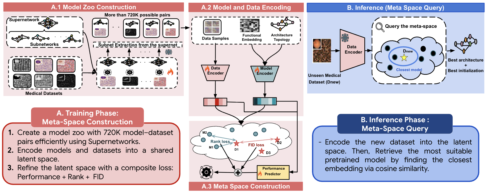

# MedNNS: Supernet-based Medical Task-Adaptive Neural Network Search

This repository contains the code for the paper:  
**"MedNNS: Supernet-based Medical Task-Adaptive Neural Network Search"**  
by Lotfi Abdelkrim Mecharbat, Ibrahim Elmakky, Martin Takac, and Mohammed Yaqub (MBZUAI).

---

## Overview

MedNNS is the first Neural Network Search (NNS) framework for medical imaging.  
It addresses the dual challenge of **architecture selection** and **weight initialization** by jointly optimizing both for any given medical dataset via meta-learning in a Supernet-based model zoo.  

Our framework supports selecting the most suitable pretrained architecture and initialization for a new task, accelerating convergence, and improving performance compared to SOTA NAS and transfer learning approaches.  

  
*Figure: High-level overview of the MedNNS framework.*  

---

## Key Features

- **Supernet-based Model Zoo:** Efficient extraction of thousands of subnetworks from a single supernet per dataset.
- **Meta-Learning Approach:** Jointly learns dataset and model embeddings with composite loss (rank loss, FID loss, performance loss) for optimal selection.
- **Plug-and-Play:** Easily query the meta-space for any new dataset to select and fine-tune the best architecture with pretrained weights.
- **Benchmark Results:** Outperforms ImageNet-transfer and NAS baselines on MedMNIST and other benchmarks.

---

## Installation

1. Clone the repository:

       git clone <repository-url>
       cd mednns

2. Install dependencies (example with `requirements.txt`):

       pip install -r requirements.txt

---

## Usage  🚧 *In Progress*  

We are actively updating this section with detailed instructions and examples.  
For now, the basic workflow is:

1. **Train a Supernet on your dataset:**

       python train_supernet.py --dataset <DATASET_NAME> --gpu <GPU_ID>

2. **Extract subnetworks and build the model zoo:**

       python extract_subnetworks.py --supernet_ckpt <CHECKPOINT_PATH>

3. **Construct the meta-space:**

       python build_meta_space.py --zoo_dir <MODEL_ZOO_PATH>

4. **Query the meta-space for a new dataset:**

       python query_meta_space.py --new_dataset <DATASET_PATH>

---

## Example  🚧 *In Progress*  

We will release more detailed runnable examples soon.  
For MedMNIST experiments:

       python train_supernet.py --dataset organmnist_axial
       python build_meta_space.py --zoo_dir ./zoo
       python query_meta_space.py --new_dataset ./MedMNIST/dermamnist

---

## Results

MedNNS demonstrates:
- An average accuracy improvement of **1.7%** across diverse datasets  
- **Faster convergence** and scalability (match/exceed competitor final accuracy in 10 epochs)  
- Robust meta-learning performance on unseen medical imaging tasks  

---

## Citation

If you use this code, please cite:

       @inproceedings{mecharbat2025mednns,
         title={MedNNS: Supernet-based Medical Task-Adaptive Neural Network Search},
         author={Lotfi Abdelkrim Mecharbat and Ibrahim Elmakky and Martin Takac and Mohammed Yaqub},
         year={2025}
       }

---

## Notes

- Some sections (Usage, Examples) are **still being expanded** and will be updated soon.  
- Please check back regularly for the latest updates.  

}
```
## License
This code and processed meta-space are made publicly available for academic research.
```
